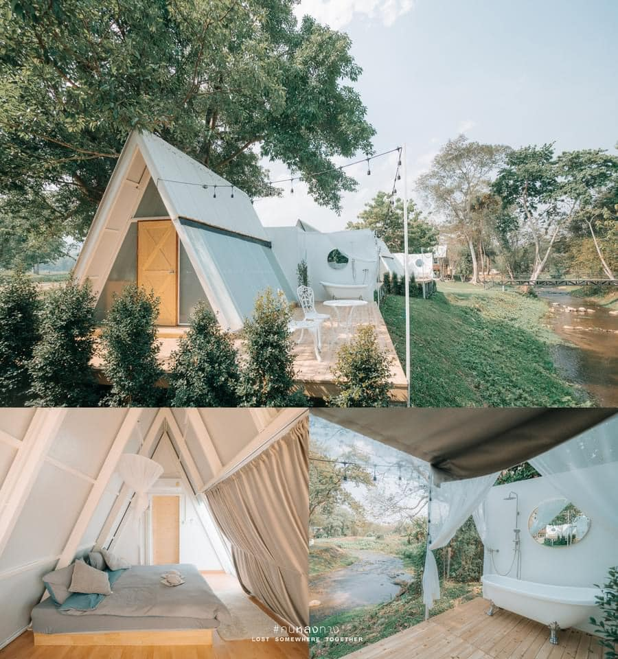

### 1. ธรรมชาติบริสุทธิ์ ไม่ปรุงแต่ง

วิวหลักล้าน เพราะตั้งอยู่2ฟากฝั่งโค้งน้ำอันสวยงามของลำธารน้ำมอญ ที่ไหลรินมาจากน้ำตกแจ้ซ้อน โอบล้อมด้วยทุ่งนา ป่า เขา ทั้งยังมองเห็นเจดีย์น้อยใหญ่ กระจายไปตามยอดภูเขาหินปูน ของวัดพระพุทธบาทสุทธาวาส แหล่งท่องเที่ยวunseenของเมืองไทย อยู่ไม่ไกล ด้วยนะ

### 2. อยู่ใกล้อุทยานแห่งชาติแจ้ซ้อน

เช้าๆลุกจากที่นอนขับรถเพียง3กิโลเมตร ก็ถึงเขตอุทยานฯ จะไปลวกไข่ อาบน้ำแร่ แช่น้ำร้อน นอนนวดผ่อนคลาย หรือจะพ้นไปเที่ยวน้ำตกแจ้ซ้อน ตอนบ่ายๆเย็นๆ ก็ไม่เป็นปัญหา

### 3. เดินทางปลอดภัย

ด้วยระยะทางเพียง70กิโลเมตรจากตัวเมืองลำปาง ถนนกว้างขวาง เส้นทางสะดวกสบาย ไม่ต้องขึ้นเขา ลงห้วย ไม่เลี้ยวลด คดเคี้ยว ไม่ต้องห่วงอันตราย รถยนต์ทุกประเภทมาได้ ไม่ต้องใช้รถท้องถิ่น บรรยากาศสองข้างทางก็อย่างฟิน มีร้านอาหาร ร้านกาแฟ จุดเช็คอิน เป็นระยะๆ

### 4. พื้นที่ร่มรื่น ส่วนตัว

เงียบสงบ กว้างขวาง ไม่แออัดยัดทะนาน เหมาะกับการชาร์จแบตร่างกาย เติมพลังให้ชีวิต พักผ่อนหย่อนใจ สามารถสูดลมหายใจได้เต็มปอด

### 5. เที่ยวได้ทั้งปีที่นี่ที่เดียว

ฤดูหนาวมีหมอกจางๆอากาศเย็นสบาย เหมาะกับการมาอาบน้ำแร่ แช่น้ำร้อน เพิ่มความอบอุ่นให้ร่างกาย หน้าฝนชุ่มฉ่ำ น้ำเต็มลำธาร ต้นไม้ใบหญ้า ทุ่งนา เขียวขจี ฤดูร้อนอากาศก็ยังดี มีน้ำตก ลำธาร ให้ได้เล่นน้ำผ่อนคลาย หรือจะลงอ่างกลางแจ้งก็ได้ ไม่ว่ากัน ที่พักยังติดแอร์ทุกหลัง นอนหลับสบาย

### 6. มีที่พักให้เลือกหลายแบบ

ทั้งบ้าน "วินเทจ" หลังใหญ่3ห้องนอน เหมาะกับการมาพักผ่อนเป็นหมู่คณะ หรือจะเป็นบ้านพัก "โมเดิร์น" 2ห้องนอน เพื่อพักผ่อนกับครอบครัว แต่ถ้าชอบแบบส่วนตัว ดีไซน์เก๋ๆ น่ารัก ชวนให้มาพัก”เอเฟรมมินิมอล”นอนหลังคาเปิดได้ ลงแช่อ่างสบายๆใต้แสงจันทร์ ถ้าฝันอยากได้แบบคลาสสิค ชิกๆก็ต้อง”เอเฟรมริมธาร”หรือจะเป็น”เต็นท์โดม”อินเทรนด์ พักเป็นคู่ๆให้เลือกดูตามชอบใจ ทุกหลังสะอาดสะอ้าน อยู่ใกล้ชิดติดลำธาร นอนฟังเสียงน้ำชิลๆ

### 7. ราคาสบายๆ จับต้องได้ เป็นกันเอง

ช่วงวันธรรมดา ก็จะต่ำกว่าวันหยุด-ศุกร์-เสาร์นิดนึง ท่านที่มาแล้วครั้งหนึ่งเช็คอินสถานที่ไว้ มาครั้งใหม่ได้ลดราคา มาเป็นคณะใหญ่เหมาทั้งหมด มีส่วนลดเป็นพิเศษ แถมยังมีโปรโมชั่นให้ท่านได้เลือกมา ตามช่วงเวลาและอัตราค่าบริการที่ตรงใจ

### 8. กิจกรรมหลากหลาย

จะเดิน วิ่ง ปั่นจักรยาน ออกกำลังกาย ถ่ายรูปวิวสวยๆ พาเด็กๆน้องๆหนูๆมาเรียนรู้ธรรมชาติ เล่นน้ำ เรียงหิน ก่อกองทราย ดูการทำไร่ทำนา หรือจะมาประชุมกลุ่มย่อย นั่งเล่นกีตาร์ คุยกันเบาๆ
ดริปกาแฟ พบปะสังสรรค์ ปิ้งย่าง นั่งทานหมูกระทะ อาหาร บนระเบียงริมธารหน้า-หลังบ้าน ก็ได้บรรยากาศ ส่วนท่านที่พักบ้านวินเทจและโมเดิร์น ก็ต้องไม่พลาดคาราโอเกะ ที่เราให้บริการฟรี ขอเพียงทุกท่านมีน้ำใจ ไม่ส่งเสียงดังรบกวนใคร หลังสี่ทุ่ม

### 9. ถ้าท่านเหมาบ้านพักทุกหลัง เพื่อพบปะ สังสรรค์ ให้รางวัลแก่ลูกค้า

หรือจะมาอบรม สัมมนา ศึกษาดูงานนอกสถานที่ เรายังมีเวที เครื่องเสียง สถานที่จัดเลี้ยง พร้อมรับติดต่อประสานงาน จัดอาหารให้ทุกมื้อ และจากนี้ไปอีกไม่นาน เราก็จะมีห้องประชุมเล็กๆ พร้อมร้านกาแฟสวยๆ อาหารและเครื่องดื่มที่เป็นซิกเนเจอร์ สวนดอกไม้ จุดเช็คอิน และลานกางเต็นท์ จอดรถบ้าน กว้างขวาง เพื่ออำนวยความสะดวกแก่ทุกท่าน ที่มาใช้บริการเป็นหมู่คณะ

### 10. เป็นจุดศูนย์กลางไปยังแหล่งท่องเที่ยวที่สำคัญของจังหวัดลำปาง

ไม่ว่าจะเป็นอุทยานแห่งชาติแจ้ซ้อน ไร่ห่มฟ้า วัดพระพุทธบาทสุทธาวาส เขื่อนกิ่วลม แปลงดอกไม้และผักโครงการหลวง บ้านใหม่พัฒนา ไร่สตรอว์เบอร์รี่ แมคคาเดเมีย สวนกาแฟ จุดชมวิวกิ่วหิน บ้านแม่แจ๋ม หมู่บ้านท่องเที่ยวเชิงเกษตรบ้านป่าเหมี้ยง จุดชมวิวกิ่วฝิ่น และเดินทางต่อไปยังบ้านแม่กำปอง จังหวัดเชียงใหม่

#### ติดตามข่าวสารเพิ่มเติมจากเราได้ที่

[Facebook Page แจ้ซ้อนวินเทจ - Chae Son Vintage](https://www.facebook.com/chaesonvintage)
